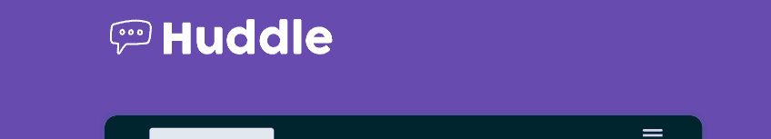
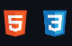

 <h1 align="center">🐱‍🚀 Quest Projeto Huddle 🐱‍🚀</h1>

 

  

## 🐱‍🚀 Descrição do projeto *
 

- Projeto do Frontend mentor, focado em formar novos desenvolvedores. 
  

  

## 🐱‍🚀 O que aprendi com o projeto *
 
- Criar uma estrutura HTML semântica e de fácil entendimento.  
- Posicionar elementos com CSS.  
- Deixar a landing - page responsiva

  

## 🐱‍🚀 Tecnologia utilizadas *
 

  

🐱‍🚀 Made with, by Samuel ✌ [See my linkedin](https://www.linkedin.com/in/samuel-dutra-13551723a/)

